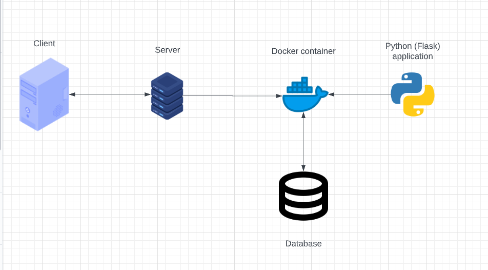

# User onboarding project with Python-Flask and PostgreSQL
I should really make a TO-DO list... But I did the TODOs' in the document as I was working on it so whatever :D

## Language choice and research:
I don't really know how Flask works, but it's not that complicated apparently.
You can use it as a templating engine (like PHP) to inject data into an HTML file. This makes the webpages dynamic (NAV-bar as an example)
In my case, I am going to point to variables from the Flask-script with tags in the HTML-file.

I don't need to know how it works fundamentally, that would probably take way too long.
Rather, I can just read the documentation for what I need to use instead. Like how a parser is written, as an example.
I have some friends who can help explain things I don't understand along the way.

Here is the data flow of the end-product:

## The website:
Firstly, we will have to set up a web service to display the website itself. 
We can use Flask to do this, with endpoints. Endpoints are generated websites that are sent to the user when certain conditions are met (the user sends data or such).
The website will use CSS from my shitty old college project because why not.

The website will have a form that sends data to the server via a POST request. 
The Flask script will handle the data and then send it to an SQL server (in this case, a PostgreSQL).
After the SQL server has handled the request, it will spit the data it accepted back out to the Flask script.
The Flask script will then display the data that the user submitted. Simple.

## PostgreSQL:
The password for the admin user is TestTestTest1 and the port number is 5432.
I called the server "userOnboardingProject".

## Containerizing
Now that I'm done with the project (and completely forgot to document along the way - I won't forget this again), I can containerise the application.
To export the dependencies easily, I used `pip freeze > requirements.txt`

The Dockerfile contains the blueprint to create the containers. Note that the commands are interpereted line-by-line in a sequential order.
